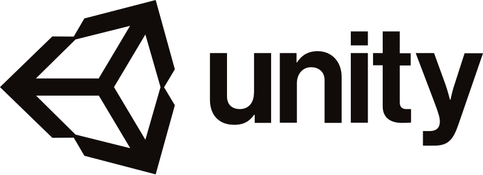
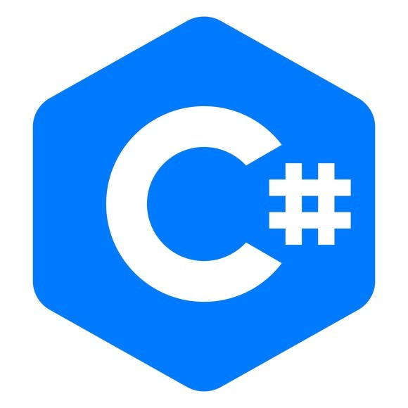

# Ferramenta

<h1 align="center">
  
</h1>

O [Unity](https://www.unity.com/) é uma das game engines mais utilizadas atualmente, devido a sua versatilidade em poder criar jogos para várias plataformas, desde consoles como nintendo switch e xbox one, até plataformas mobile.

## Por quê usar unity?
No mercado atual o desenvolvimento mobile em unity está em alta, assim como grande parte de projetos em VR (Realidade virtual) ou AR (Realidade aumentada), tendo jogos como <i>Hearthstone</i>, <i>Cuphead</i>, <i>Legends of runeterra</i>, <i>Ori and the blind forest</i> e <i>Monument Valley</i> sido feitos no unity. 

Apesar de existirem engines mais simples para desenvolvimento de jogos como o Construct2 por exemplo, o unity consegue ser uma plataforma onde a curva de aprendizado não é tão alta para fazer projetos mais simples, porém caso o desenvolvedor tenha um conhecimento avançado, ele tem liberdade o suficiente para fazer projetos mais complexos que seriam impossíveis em engines menos robustas.

## Linguagem de programação
<h1 align="center">
  
</h1>

Antes o unity aceitava C#, javascript e boo como linguagens de programação, porém atualmente o suporte é 100% ao C# e é esta linguagem que utilizaremos futuramente ao fazer nossos projetos. Caso você nunca tenha estudado programação, não se preocupe, iremos ensinar o básico sobre C#.

A parte de desenvolvimento de games precisa que o desenvolvedor faça projetos diversos para ganhar experiência em lidar com os diversos tipos de problema que aparecem em cada plataforma ou estilo de jogo, por isso ao fim da apresentação básica do unity e visual studio, faremos um projeto de jogo 2D.

[Próxima Seção](./2-Editor.md)