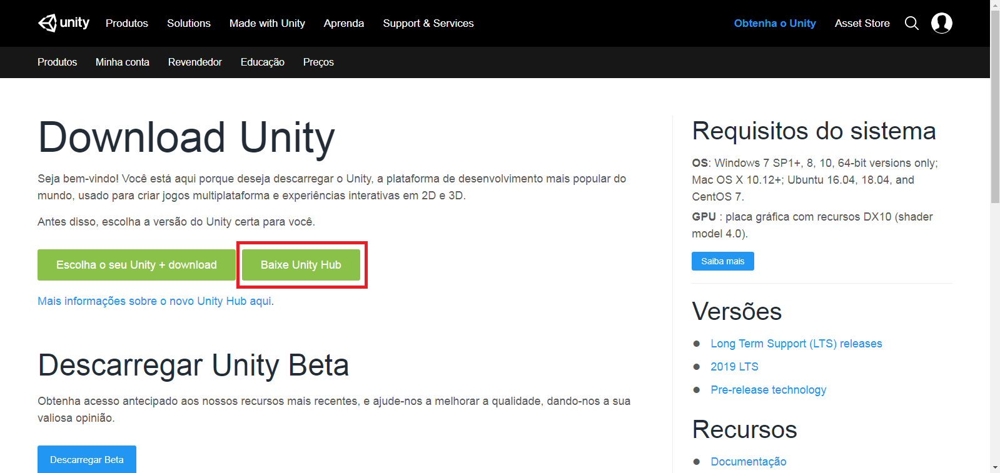
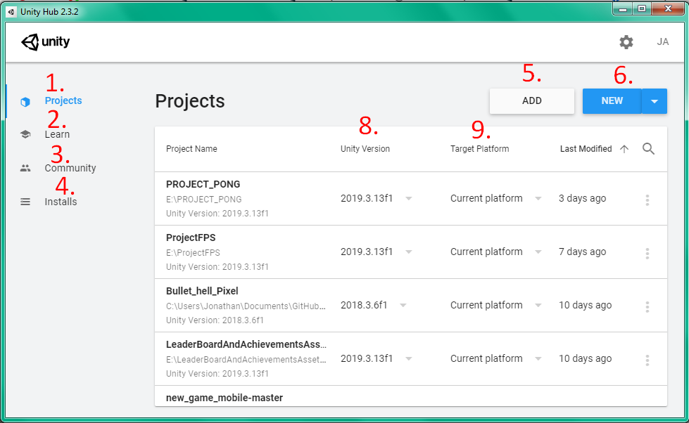
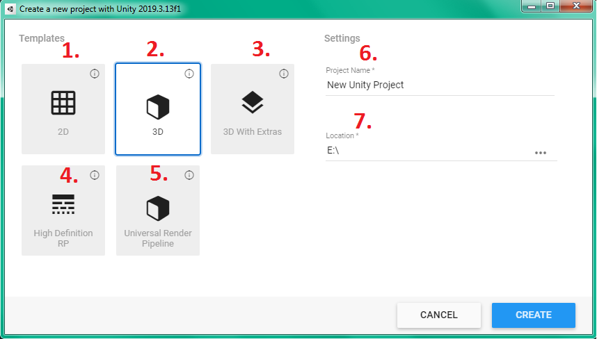

# Configuração de ambiente - Unity hub

O Unity Hub é uma aplicação que facilita a administração de projetos. 

Como o unity é separado em versões, pode ser que você precise usar versões diferentes para projetos pessoais/comerciais. O Unity Hub serve como uma aplicação centralizada para os projetos, podendo além de criar novos, importar projetos de exemplo da própria unity.

Para instalar o UnityHub, clique [aqui](https://unity3d.com/pt/get-unity/download) e escolha a opção "Baixe Unity Hub".

<h1 align="center">
  
</h1>

Após isso, só prosseguir com a instalação até aparecer esta tela:

<h1 align="center">
  
</h1>

1. - Ao clicar aqui, visualizam-se projetos que já foram trabalhados no unity hub
2. - Parte de aprendizado do unity, onde ficam projetos prontos.
3. - Fóruns e coisas relacionadas a comunidade
4. - Todas as verões do unity que estão instaladas. Ao clicar aqui, aparece uma tela onde pode-se adicionar novas versões do unity ou localizá-las caso já estejam instaladas.
5. - Localizar projeto no windows
6. - Criar um novo projeto
7. - Configurações avançadas
8. - Versão do unity utilizada no projeto
9. - Plataforma alvo do projeto.

Com a interface explicada, baixe a versão do unity mais atualizada e prepare-se para criar um novo projeto.

Ao clicar em "New", uma nova tela surge:

<h1 align="center">
  
</h1>

Na tela são apresentados alguns templates para criação do game, sendo:

1. - 2D, cena já vem com câmera no modo isométrico e assets para administração de sprites previamente instalados. É a opção caso você queira um game 2D.
2. - 3D, é o padrão para quem quer fazer um jogo 3D do zero utilizando o unity.
3. - 3D with extras, é o mesmo que o 3D padrão, porém ele vem com exemplos prontos.
4. - HDRP, é um projeto 3D, porém vem com exemplos e configurações para quem quer fazer jogos com um gráfico mais fotorrealista.
5. - URP, é para projetos 3D que utiliza um novo renderizador do unity.
6. - Nome do projeto.
7. - Local onde o projeto ficará no sistema.

Selecione 2D, já que mais a frente faremos um projeto 2D utilizando o unity.

[Próxima Seção](../3-Ambiente/2-VisualStudio.md)