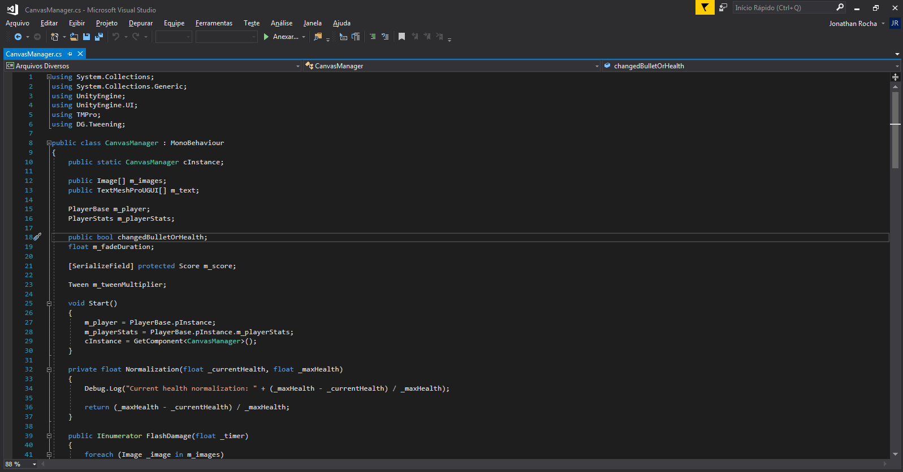

# Visual Studio

<h1 align="center">
  
</h1>

O Visual Studio Community normalmente é instalado em conjunto com o unity. Configuração extra não é necessária pois quando você abre os scripts pelo próprio editor do unity, ele abre o VStudio automaticamente. Não são necessários testes nem inicializar pela IDE quando se quer fazer algum teste de script, então caso não tenha sido instalado com o unity hub, clique [aqui](https://visualstudio.microsoft.com/pt-br/vs/) para baixar o Visual studio community 2019. Durante a instalação, ao aparecer opções do que se vai utilizar, é necessário que você escolha a opção de jogos, o VScommunity instalará tudo necessário para editar os scripts.

[Próxima Seção](../3-Ambiente/1-UnityHub.md)